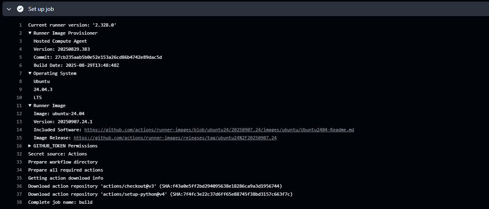

# Rapport Labo 1
## William Lavoie
### 💡 Question 1 : Si l’un des tests échoue à cause d’un bug, comment pytest signale-t-il l’erreur et aide-t-il à la localiser ? Rédigez un test qui provoque volontairement une erreur, puis montrez la sortie du terminal obtenue.

J’ai introduit une erreur dans la fonction addition  pour l’exemple et comme on peut le constater, pytest indique exactement la cause de l’erreur, soit un assert qui échoue ainsi que le test, le fichier et la ligne ou l’erreur a été déclenché. Cela aide à localiser l’erreur puisque nous pouvons aller consulter le test et voir d’où vient l’erreur.

### 💡 Question 2 : Que fait GitLab pendant les étapes de « setup » et « checkout » ? Veuillez inclure la sortie du terminal Gitlab CI dans votre réponse.

À noter que à cause de problèmes techniques, Github Actions a été utilisé plutôt que Gitlab.

Dans l'étape de « setup », Github crée une machine virtuelle, dans ce cas-ci avec comme OS Ubuntu-24.04. Il configure également les permissions nécessaires, spécifiquement sous la ligne GITHUB_TOKEN Permissions. Finalement, les répertoires contenant les actions sont téléchargés afin que le pipeline puisse être exécuté, comme on le constante aux lignes 36 et 37.

En ce qui concerne l'étape « checkout », le dépot git est copié dans le machine virtuelle. Cela permet au pipeline d'avoir accès au code source afin de faire les différentes actions, dont rouler les tests.

### 💡 Question 3 et Question 4: Non répondus à cause de problème par rapport au CD sur la VM.